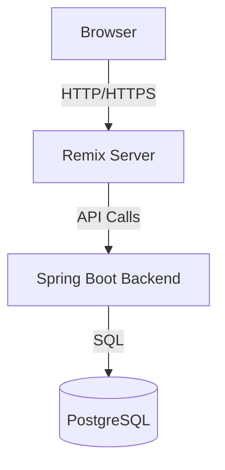

# Cherry Test Management Platform


Cherry is a modern test case management platform that helps teams organize, track, and execute their testing efforts efficiently.

## Features

-  Project Management
-  Test Case Creation and Organization
-  Test Run Execution
-  Custom Property Configuration

## Technology Stack

### Frontend

-  [Remix](https://remix.run/) - Full stack web framework
-  [React](https://reactjs.org/) - UI library
-  [Tailwind CSS](https://tailwindcss.com/) - Styling
-  [TypeScript](https://www.typescriptlang.org/) - Type safety

### Backend

-  [Spring Boot](https://spring.io/projects/spring-boot) - Backend framework
-  [Kotlin](https://kotlinlang.org/) - Programming language
-  [PostgreSQL](https://www.postgresql.org/) - Database

## Architecture Overview

Cherry follows a three-tier architecture:

1. **Frontend (Remix + React)**

   -  Handles UI rendering and client-side state
   -  Uses Remix for server-side rendering and data loading
   -  Communicates with backend via REST API

2. **Backend (Spring Boot)**

   -  Implements business logic and API endpoints
   -  Manages data persistence operations

3. **Database (PostgreSQL)**

   -  Stores all application data



## Running the development server

### Prerequisites

-  Node.js >= 20.0.0
-  npm or yarn
-  JDK 21 or later
-  Kotlin 1.9.x
-  PostgreSQL 15+
-  Clone of the repository

### Running the backend

1. Configure database environment variables

In this example, we'll connect to a postgres database running locally named `example-database`:

```
DATABASE_URL=jdbc:postgresql://localhost:5432/example-database
DATABASE_USERNAME=your_username
DATABASE_PASSWORD=your_password
```

2. Start the backend application

Once the environment variables are setup, the service is ready to run. This can be done through your favorite IDE, such as IntelliJ, or by running the gradle script manually.

To boot the backend via gradle directly, open a new terminal window and navigate to the project directory. Next, run the following commands:

```bash
cd service
./gradlew bootRun
```

The backend server will start on `http://localhost:8080` by default.

### Running the frontend

1. Install dependencies

Navigate to the client directory from with the project directory and install the required packages:

```bash
cd client
npm install
```

2. Configure environment variables

Create a `.env` file in the frontend directory:

```bash
# Backend API URL
VITE_API_URL=http://localhost:8080
```

3. Start the development server

```bash
npm run dev
```

The frontend development server will start on `http://localhost:5173` by default. You can now access the application in your web browser.
