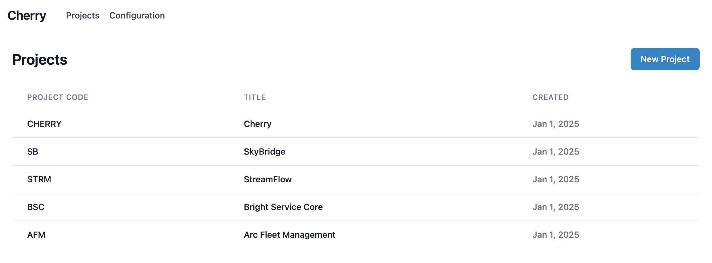
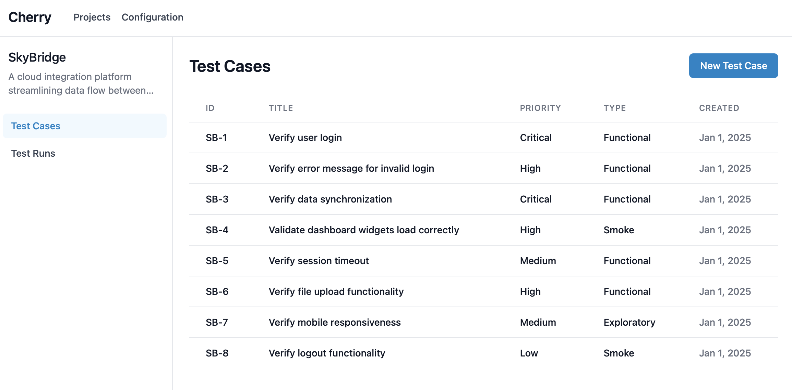
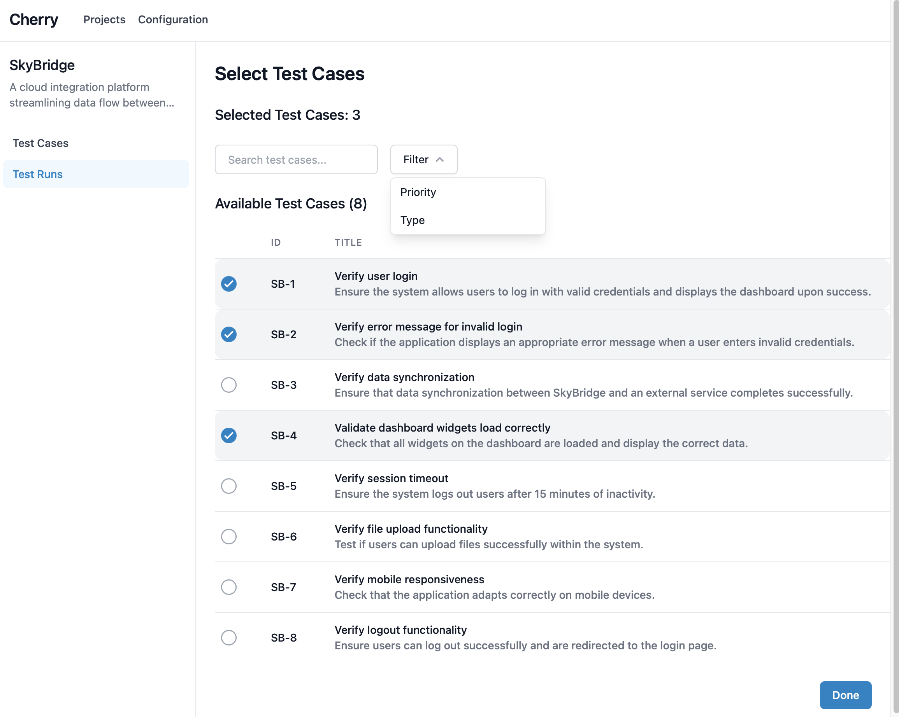
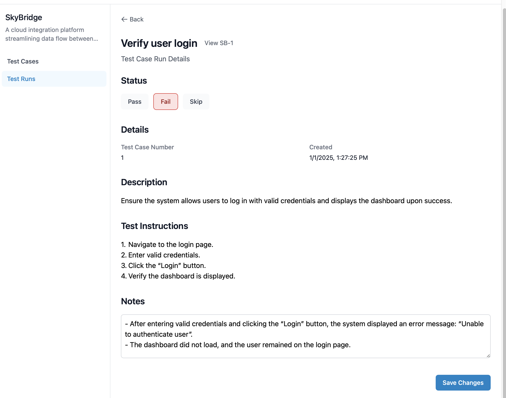
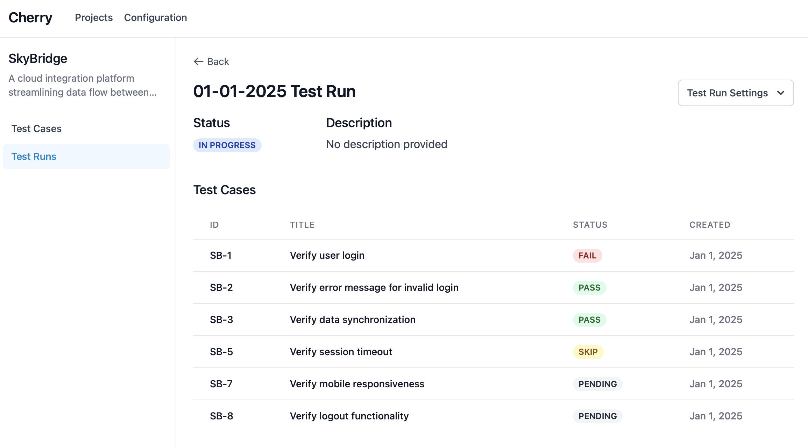
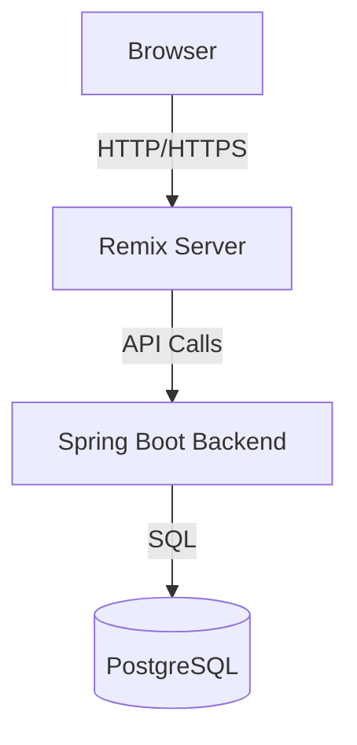

# Cherry Test Management Platform


Cherry is a modern test case management platform that helps teams organize, track, and execute their testing efforts efficiently. Built on top of enterprise-grade open source tools, Cherry provides a robust and reliable solution for managing and executing test cases.

## Features

### Project Management



Manage your team's projects and test cases in a structured way.

### Test Case Creation and Organization



Create and organize your test cases for each of your projects.

### Test Runs

#### Creation



Filter and select the test cases you want to run.

#### Test Case Results



Document the results of each test case with a status and any notes or observations.

#### Test Run Progress



View the progress of your test run and see the results of each test case.

### Additional Features

-  Custom property configuration for test cases
-  Export test plan and test run results to document

## Architecture Overview

Cherry follows a three-tier architecture:

1. **Client service (Remix + React)**

   -  Handles UI rendering and client-side state
   -  Uses Remix for server-side rendering and data loading
   -  Communicates with backend via REST API

2. **Backend service (Spring Boot)**

   -  Implements business logic and API endpoints
   -  Manages data persistence operations

3. **Database (PostgreSQL)**

   -  Stores application data



## Deploying Cherry to production

### Prerequisites

-  Docker and Docker Compose
-  PostgreSQL instance (self-hosted or cloud provider)
-  Clone of the repository

### Application setup

We'll need to perform the initial migration of the database schema. This can be done by running the following steps:

1. Configure environment variables

Create a `.env` file in the root directory:

```
DATABASE_MIGRATION_MODE=MIGRATE
DATABASE_URL=jdbc:postgresql://<your-db-host>:5432/<your-db-name>
DATABASE_USERNAME=<username>
DATABASE_PASSWORD=<password>
```

2. Start the backend service

Run Docker Compose to build and start the backend-service container:

```bash
docker compose up backend-service --build
```

This will take some time to build and run. The application will migrate the database to the latest schema and shut down automatically once complete.

### Running the application

1. Update the environment variables to turn off migration mode

```
DATABASE_MIGRATION_MODE=NONE
```

2. Build and start the application

```bash
docker compose up --build
```

The application will be available at `http://localhost:3000` by default.

1. Verify deployment

Check that all containers are running:

```bash
docker compose ps
```

You should see both the client and backend services running successfully.

## Running the development server

### Prerequisites

-  Node.js >= 20.0.0
-  npm or yarn
-  JDK 21 or later
-  Kotlin 1.9.x
-  Clone of the repository

You will also need a postgres database instance, either running locally or in a cloud provider.

### Running the backend service

1. Configure database environment variables

In this example, we'll connect to a postgres database running locally named `example-database`:

```
DATABASE_MIGRATION_MODE=MIGRATE # this setting will trigger the database migration
DATABASE_URL=jdbc:postgresql://localhost:5432/example-database
DATABASE_USERNAME=your_username
DATABASE_PASSWORD=your_password
```

2. Update the backend service to the latest schema

Once the environment variables are setup, the service is ready to run. This can be done through your favorite IDE, such as IntelliJ, or by running the gradle script manually.

To boot the backend via gradle directly, open a new terminal window and navigate to the project directory. Next, run the following commands:

```bash
cd service
./gradlew bootRun
```

The backend service will start up and migrate the database to the latest schema. Once complete, the service will shut down automatically.

3. Run the backend service

We'll need to update the environment variables to turn off migration mode:

```
DATABASE_MIGRATION_MODE=NONE # this setting will run the service normally
```

Running the service again will now start the backend service on `http://localhost:8080` by default.

### Running the client service

1. Install dependencies

Navigate to the client directory from with the project directory and install the required packages:

```bash
cd client
npm install
```

2. Configure environment variables

Create a `.env` file in the frontend directory:

```
# Backend API URL
VITE_API_URL=http://localhost:8080
```

3. Start the development server

```bash
npm run dev
```

The frontend development server will start on `http://localhost:5173` by default. You can now access the application in your web browser.
